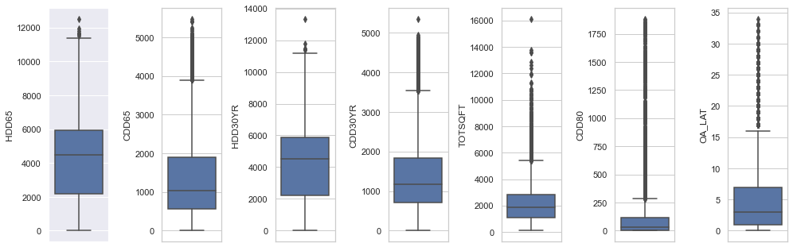
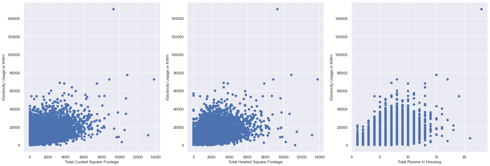
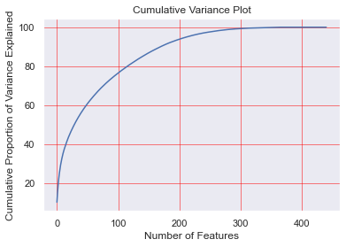
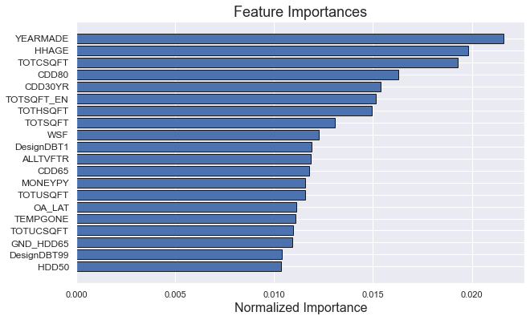
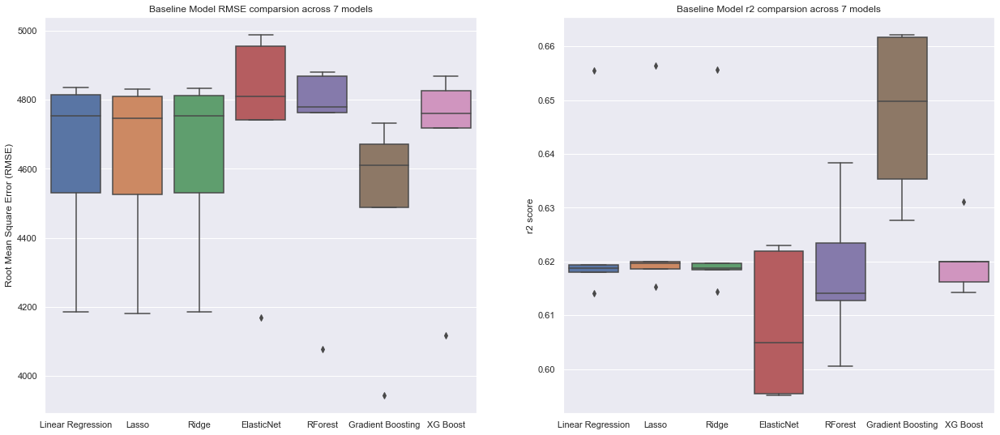
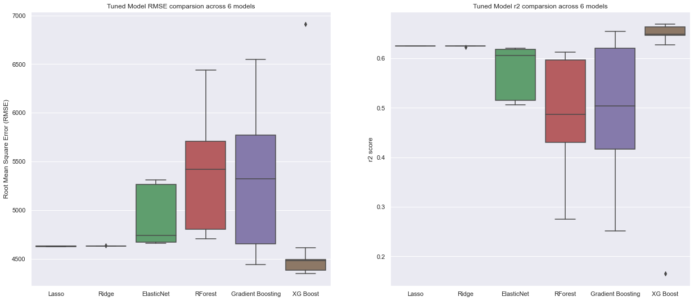

# Residential Energy Prediction 

Welcome to the Residential Energy Consumption Prediction project – now adapted and documented by **Sreeja indrala**.

> Forked and enhanced from the original [project](https://github.com/nipun-goyal/Residential-Energy-Consumption-Prediction).

## 📘 Contents
- [Project Overview](#project-overview)
- [EDA and Data Transformation](#eda-and-data-transformation)
- [Principal Component Analysis (PCA)](#principal-component-analysis-pca)
- [Feature Selection](#feature-selection)
- [Baseline Models](#baseline-models)
- [Hyperparameter Tuning](#hyperparameter-tuning)
- [How to Run the Project](#how-to-run-the-project)

## 📊 Project Overview

This project is based on the **2009 Residential Energy Consumption Survey (RECS)** from the [U.S. Energy Information Administration (EIA)](https://www.eia.gov/consumption/residential/data/2009/). It involves analyzing over **900 features** related to household characteristics and predicting **annual electricity usage (KWH)** using machine learning.

We apply:
- Dimensionality reduction (PCA)
- Feature selection (custom FeatureSelector class)
- Supervised learning (Linear and Ensemble Models)
- Hyperparameter tuning (GridSearchCV)

---

## 🔍 EDA and Data Transformation

- Visualized outliers using boxplots and KDE
- Merged infrequent levels of discrete variables
- Removed features with too many `NA`, redundant flags (`Z` columns), and duplicates
- Dropped extreme outliers (e.g., kWh > 80,000)

Plots:



---

## 🧪 Principal Component Analysis (PCA)

PCA was used to estimate feature reduction. We found:
- ~200 components explain >95% of the variance
- Helped set a benchmark for later feature selection



---

## 🔧 Feature Selection

We used a custom `FeatureSelector` to reduce 428 features down to 216 using:

- Missing value threshold (>60%)
- High correlation (>98%)
- Zero importance (based on one-hot encoded tree models)
- Low cumulative importance (<90%)
- Single unique value



---

## ⚙️ Baseline Models

We trained basic models including:
- Linear Regression, Ridge, Lasso
- Decision Trees, Random Forest, XGBoost

Used **cross-validation** to get stable performance estimates:



---

## 📈 Hyperparameter Tuning

Used `GridSearchCV` across all models. Best performing model: **XGBoost**, based on lowest RMSE.



---

## 🚀 How to Run the Project

```bash
# Clone the repository
git clone https://github.com/BytesofSurajm/Residential-Energy-Consumption-Prediction.git
cd Residential-Energy-Consumption-Prediction

# Create virtual environment
python -m venv venv

# Activate virtual environment
# Windows:
venv\Scripts\activate
# macOS/Linux:
source venv/bin/activate

# Install dependencies
pip install -r requirements.txt

# Launch Jupyter Notebook
jupyter notebook
```

Open `1.0-Residential-Energy-Modeling.ipynb` and run all cells.

---

### 👨‍💻 Author
Maintained by **Sreeja** | 
*Built for students, educators, and curious minds in energy analytics.*

---

**Happy Learning!**
